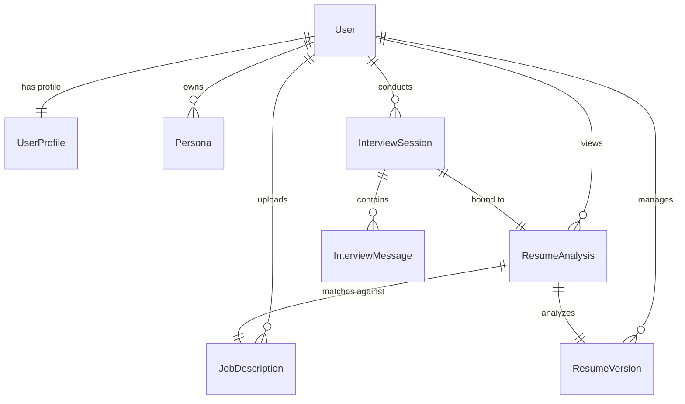

<div align="center">
  
  <h1>Resume Analyzer</h1>
  <p><strong>Bypass the ATS. Optimise Your Profile. Secure the Interview.</strong></p>
  <p>An enterprise-ready, data-driven resume parsing and optimization suite built with Python, Django, Supabase, and Groq's high-throughput Llama-3 models.</p>

  <p>
    <a href="https://python.org"></a>
    <a href="https://djangoproject.com"></a>
    <a href="https://supabase.com"></a>
    <a href="https://groq.com"></a>
    <a href="https://pytest.org"></a>
  </p>
</div>

---

## 🌟 Executive Summary

**Resume Analyzer** is a state-of-the-art career-acceleration application designed to help job candidates align their resumes with modern corporate recruitment systems. By leveraging advanced natural language processing (NLP) and vector keyword models, the platform identifies skill gaps, analyzes formatting syntax, exposes parsing vulnerabilities, and generates immediate upskilling pathways. 

Featuring interactive mock interview simulations, an inline resume editor with live scoring recalculation, and a bespoke cover letter generator, it acts as a private, 24/7 technical recruiter.

---

## 🚀 Key Platform Features

### 1. ATS Parsing & Formatting Vulnerability Scanner
*   **File Formats:** Full document structure parsing for both `.pdf` and `.docx` formats.
*   **Vulnerability Detection:** Scans for elements that break standard parser pipelines (e.g., hidden text, tables, single-column vs multi-column issues, complex vector layouts, non-standard system fonts, and "keyword stuffing" exploits).
*   **ATS Score:** Direct 0-100 quantitative score matching resume syntax against job description profiles.

### 2. Live Inline Resume Editor & Real-time Re-Scoring
*   **Direct Modification:** Edit resume lines and bullet points directly inside the web interface without modifying or re-uploading the source document.
*   **Instant Recalculation:** Click to trigger a lightweight score recalculation API that feeds updated sections to the AI model, recalculating match score and structural changes on-the-fly.

### 3. AI Bullet Point Optimizer (STAR/XYZ Frameworks)
*   **Passive-to-Active Rewriting:** Analyzes weak or descriptive resume bullet points and generates metrics-driven, action-oriented suggestions.
*   **Framework Alignment:** Translates accomplishments into standard STAR (Situation, Task, Action, Result) or Google's XYZ (Accomplished [X] as measured by [Y], by doing [Z]) structures.

### 4. Interactive Recruiter Mock Interview Simulator
*   **Tailored Chat Role-Play:** Dynamically generates interview tracks tailored to the candidate's exact experience gaps, target job profile, and industry.
*   **Question-by-Question Interaction:** An AI Recruiter grills the candidate, analyzing their responses.
*   **Actionable Evaluation:** Provides instant scoring (0-100) and detailed critique on technical depth, behavioral structure, and phrasing after each response.

### 5. Magic Cover Letter Builder
*   **Bespoke Customization:** Asynchronously generates cover letters by matching candidate background with job descriptions.
*   **Tuning Parameters:** Custom settings for tone (Professional, Creative, Bold), word length, and targeted highlights of specific career achievements.

### 6. Premium PDF Document Exporters
*   **ATS-Compliant Resume Templates:** Download optimized resumes directly from the application in three clean, professional layout themes: *Executive*, *Minimal*, and *Modern*.
*   **Detailed Analytics Reports:** Export comprehensive, print-ready matching reports and generated cover letters with a single click.

### 7. Dual Authentication Paths (OAuth2 & SMS/Email OTP)
*   **Social Sign-In:** Complete integration with **Google**, **Microsoft**, and **Apple** identity providers via `django-allauth`.
*   **Passwordless Login:** OTP verification via SMS (Twilio integration) and Email for frictionless onboarding.

### 8. Monetization & Coupon Verification Engine
*   **Tiered Pricing:** Access limits split across Basic Demo, Standard, Pro, and Enterprise tiers.
*   **Payment Gateway:** Built-in checkout experience using **Razorpay**.
*   **Discount Code Handler:** API endpoint to validate coupons, track utilization limits, and calculate dynamic pricing.
*   **Automated Webhooks:** Secure Razorpay webhook listener to provision subscription changes immediately.

---

## 🛠 Tech Stack & Architecture

### Backend Core
*   **Framework:** Django 5.1 & Python 3.12+
*   **Task Queue:** Django-Q backend worker for non-blocking, asynchronous execution of long-running LLM completions.
*   **Security & Encryption:** Symmetric Fernet database field encryption (`cryptography` package) ensures that all plain text resumes, job descriptions, and user profile data remain secure in transit and at rest.

### Database Layer
*   **Provider:** Supabase PostgreSQL
*   **Connection Management:** Connection pooling enabled for high availability and low latency.

### AI Engine
*   **Provider:** Groq API Cloud
*   **Models:** High-throughput `llama-3.3-70b-versatile` & `llama-3-8b-8192` configurations with automatic failover to handle processing requests.

### Frontend Layer
*   **Styling:** Modern Tailwind CSS styling with an aesthetic glassmorphic theme supporting dark and light modes.
*   **Interactive Components:** React 18 integration for dynamic forms (e.g., Cover Letter customizers, mock interview interfaces).

---

## 📊 Database Schema Details



*   **`UserProfile`**: Tracks monetization tiers (0=Free, 1-4=Premium), period dates, Razorpay IDs, and verification statuses.
*   **`ResumeAnalysis`**: Stores match percentages, list-formatted skill gaps, suggestions, formatting issues, and API usage stats (prompt and completion token metrics).
*   **`InterviewSession` & `InterviewMessage`**: Manages state, conversation logs, and AI evaluation feedback for the mock interview preparation tool.
*   **`Coupon`**: Configures discount codes, activation flags, and usage metrics.

---

## ⚙️ Local Installation & Setup

### Prerequisites
*   Python 3.12 or newer installed.
*   A Supabase database or local PostgreSQL instance (defaults to SQLite if no URL is provided).
*   API keys for Groq, and optionally Razorpay, Twilio, and Google Developer Console.

### 1. Clone and Prepare Environment
```bash
git clone https://github.com/bhatiaayan30/Resume_Analyzer.git
cd Resume_Analyzer
```

### 2. Configure Virtual Environment and Dependencies
It is recommended to use `uv` or a standard python `venv` to isolate packages:
```bash
python -m venv .venv
source .venv/bin/activate  # On Windows: .venv\Scripts\activate
pip install -r requirements.txt
```

### 3. Establish Local Configuration (`.env`)
Copy the template configuration and fill in your developer keys:
```bash
cp .env.example .env
```
Ensure you set the following variables in `.env`:
*   `SECRET_KEY`: Secure random string.
*   `GROQ_API_KEY`: API token from Groq Console.
*   `DATABASE_URL`: Connection string to Supabase/PostgreSQL. Leave empty to fallback to local SQLite.
*   `RAZORPAY_KEY_ID` & `RAZORPAY_KEY_SECRET`: Razorpay tokens.
*   `TWILIO_ACCOUNT_SID` & `TWILIO_AUTH_TOKEN`: Twilio details (only needed for SMS OTP).

### 4. Run Migrations and Start the Servers
Initialize your database structures:
```bash
python manage.py migrate
```

Start the primary web application:
```bash
python manage.py runserver
```

In a separate terminal, start the background worker queue (Django-Q):
```bash
python manage.py qcluster
```
*(Windows: If the worker terminal loops during termination, run `./kill_qcluster.bat` to clear running instances.)*

Access the dashboard locally at `http://localhost:8000`.

---

## 🧪 Automated Testing

We maintain high codebase quality with comprehensive testing. 
*   **Test Suite:** `pytest` & `pytest-django` covering parsing logic, billing webhooks, security validators, coupon engines, and model configurations.
*   **Execution Command:**
    ```bash
    pytest
    ```
*   **Coverage Reporting:** Automated terminal reports indicating test coverage density.

---

## 🚢 Production Deployment

The project is fully containerized and production-hardened for platforms like **Google Cloud Run** or standard virtual private servers.

### Container Details (`Dockerfile`)
The build file compiles using a python-slim base image, installs essential build systems (`build-essential`, `libpq-dev` for Postgres connections), caches requirements, and uses `supervisord` to manage Gunicorn processes:
```dockerfile
# Build image
FROM python:3.11-slim
WORKDIR /app
RUN apt-get update && apt-get install -y build-essential libpq-dev && rm -rf /var/lib/apt/lists/*
COPY requirements.txt /app/
RUN pip install -r requirements.txt
COPY . /app/
RUN python manage.py collectstatic --noinput
EXPOSE 8080
ENV PORT 8080
CMD ["supervisord", "-c", "/app/supervisord.conf"]
```

### Google Cloud Run Deployment Runbook
1.  **Configure GCP**: Enable Cloud Build and Cloud Run APIs in your Google Cloud Project.
2.  **Continuous Integration**: In the Cloud Run console, connect your service to your GitHub repository.
3.  **Build triggers**: Select the production branch (e.g. `master` or `main`) to deploy a new version automatically on git push.
4.  **Inject Variables**: Add all parameters from your `.env` configuration as environment variables within Cloud Run's service settings.
5.  **Provision Service**: Execute the build deployment and receive your SSL-encrypted production URL.

---

<div align="center">
  <sub>Built with care to optimize professional careers.</sub>
</div>
